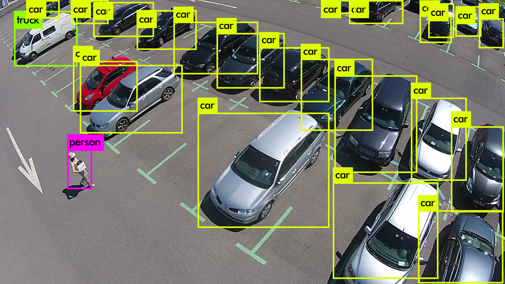
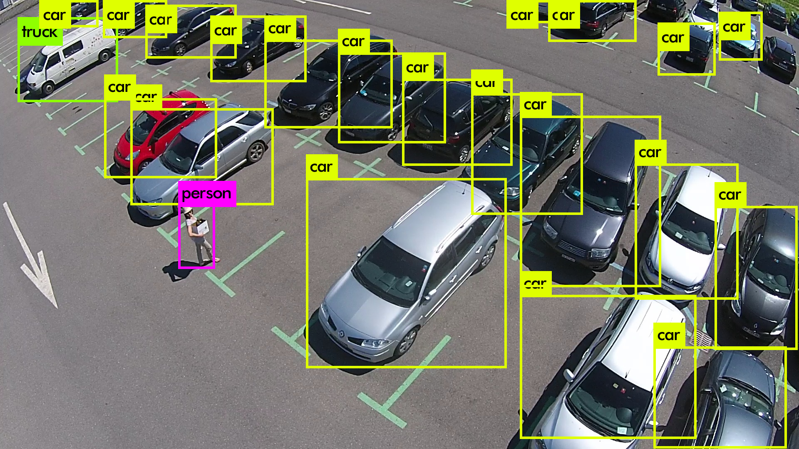
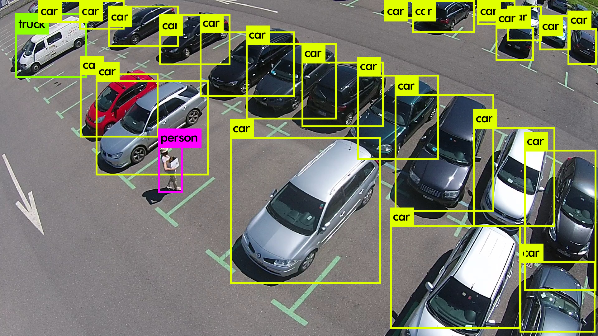
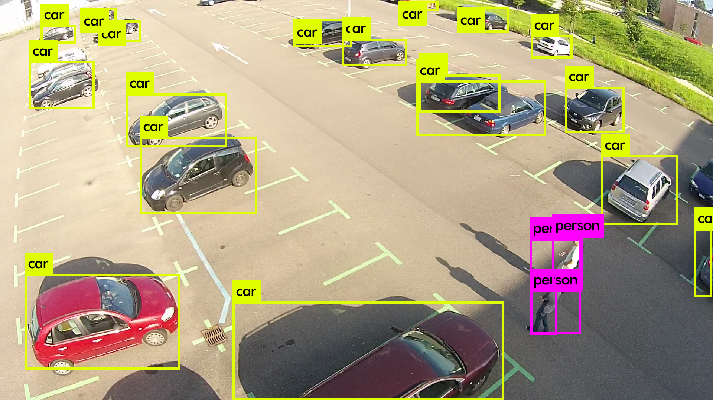
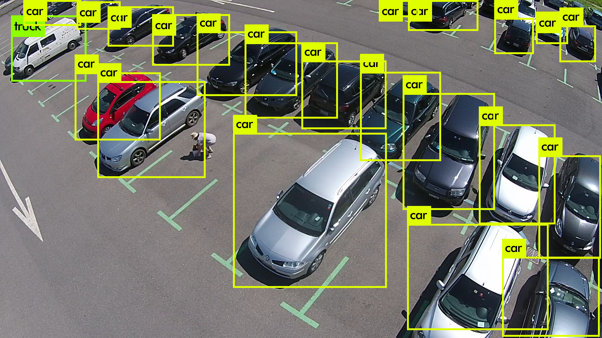

## Experiments in Object Tracking

Experiments in object tracking using YOLO.

## Running

Compiling darknet

```bash
cd darknet
make
```

Downloading pre-trained weights

```bash
wget https://pjreddie.com/media/files/yolov3.weights
```

## Some examples

Here we run YOLO on some frames extracted from videos of the [EPFL Mini-drone dataset](https://mmspg.epfl.ch/mini-drone).

# Good detections

## Good





## Bad




